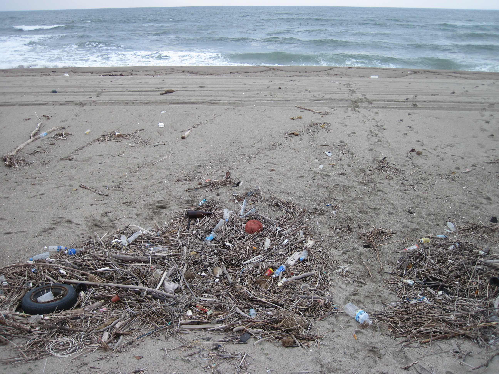
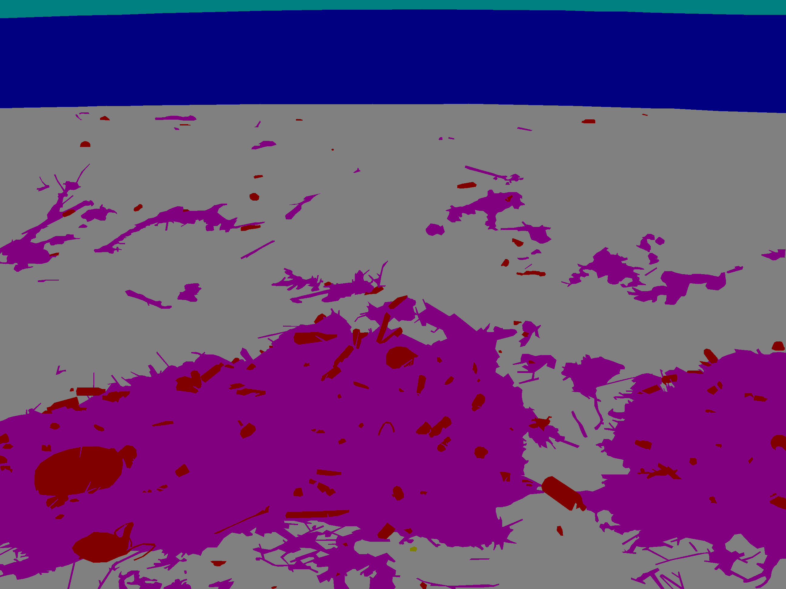
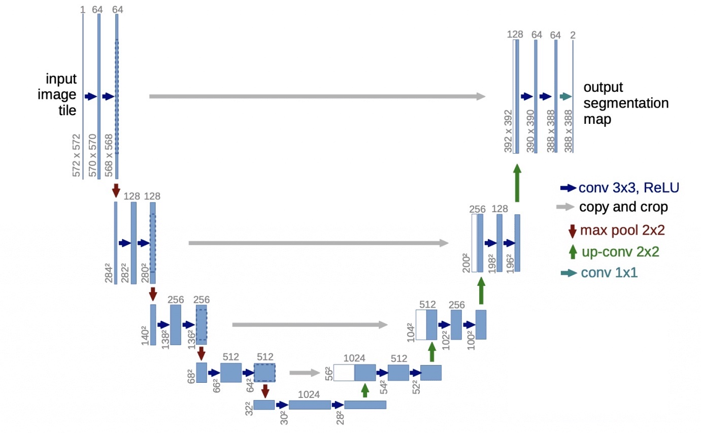
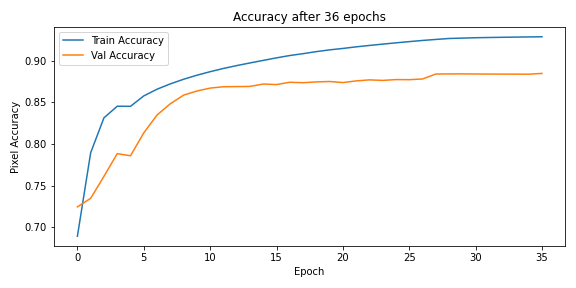

# Beach Litter Computer Vision via Image Segmentation

Beach litter is a well documented problem. <a href="https://pubmed.ncbi.nlm.nih.gov/35114542/">Hidaka et al</a> have made their <a href="https://www.seanoe.org/data/00743/85472/"> labeled data</a>, 3,500 pictures of a beach in Yamagata Prefecture, Japan with masked versions of the images showing the location of 8 classes of material on the beach:

1. Artificial Litter (80, 0, 0) red
2. Background (0, 80, 0 ) green
3. Living (80, 80, 0) light green
4. Sea (0, 0, 80) blue
5. Natural Litter (80, 0, 80) purple
6. Sky (0, 80, 80) light blue
7. Sand Beach (80, 80, 80) grey
8. Non Living (40, 0, 0) brown

Below is an example of a hand generated mask of the dataset; it is the mask for the image above.

# 1) Task

## 1.1) Semantic Image Segmentation

Semantic image segmentation is the computer vision task of classifying each pizel of an image as one of a pre-defined set of classes. Thus, Hidaka et al have provided a small training set for a semantic image segmentation computer vision problem. 

# 2 Model
## 2.1) Architecture:U-Net

I chose to use the U-Net architecture because of its small size and resultant ability to create models that can fit on mobile devices, and thus run locally with low time latency. A schematic of the architecure is shown below. 

### 2.2.1) Encoder

The left side of the diagram above shows the part of the neural network wherein 5 blocks of 3 layers, conv conv pool, transform the data from wide and shallow to narrow and deep. This modularity, hirearchy, reuse paradigm is considered best practices in modern computer vision. (<a href="https://booksdrive.org/deep-learning-with-python-by-francois-chollet-pdf-free-download/">Chollet, section 9.3</a>) 

Note: The numbers in the inmage are not in line with the numbers used in my model. 

### 2.2.2) Decoder

The right side of the diagram shows a decoder process, where the narrow but deep data is returned to its original wide and shallow status. In this process, the labels of semantic segmentation are applied to pixels in a way that increases likelyhood that contigous pixels are in the same class. 

### 2.2.3) Residuals

The grey horizontal arrows indicate that the imputs to the decoder blocks are not just the previous layers of the decoder process, but also copies of the tata from an ecoder stage. This further enables U-Net to regain location information in the decoder process. 

## 2.2) Pre-Trained U-Net

MobileNetV2 is a pre-trained neural network. It caught my attention when I cam across <a href="https://www.youtube.com/watch?v=kXsBbDGUbpw"> a video</a> by <a href="https://twitter.com/nikhilroxtomar">Nikhil Tomar,</a> using the pre-trained NN to make a model for colonoscopy image data. Since then I have laerned that 
- MobileNet has a new version V3 that outperforms V2,
- DeepLabV3 is considered the modern pre-trained NN for semantic segmentation. 

## 2.3) Tweaks

### 2.3.1) Tomar's
Tomar modified the default structure of MobileNetV2 to give out arrays of shape (224,224,1) for his binary pixel classification project.

### 2.3.2) Cherney's 
To match the training data from Hidaka et al, I modified Tomar's code to give out arrays of shape (224,224,8), with each pixel giving a probability of inclusin in class 1 through 8 listed above. 

## 2.4 Training) 
### 2.4.1) Overfitting
Initially, all layers of MobileNetV2 with Tomar and Cherney's modifications were trained on 2,800 of the image mask pairs with 350 pairs held out for validation. The goal was to obtained an overfit model. While this goal was met to some extent (train and validation accuracy 92.8% and 88.5%, respectively), it was found that the architecture of U-Nets are not likely to grossly overfit due to
- their small size and
- their depthwise separable convolutions.

### 2.3.2) Regularizing
With the encoder layers frozen, the model has less ability to overfit to the training data, and in this training session the train and validation accuracy reached 90.4% and 88.0%, respectively. While the validation score is slighly lower for this model than for the model with all layers trainable, this shoudl be considered the more trust worthy model due to
- its lower difference (2.45 points instead of 4.40 points) between train and validation accuracy, showing less specialization to the traineing set and thus better generalization to the ideal data manifold
- re-training early levels of a convolutional neural net tends to erase the generalities the net learned about a broader set of images, replacing that genarlity with specialization on the smaller current training set, leaving it less able to generalize away from the training set. 

A third training session with data augmented by random zooming and rotation (between -10 and 10 degrees) could not be complete by the time of this writting, but should provide further regularization of the model; in such training the network will not see the same image twice in two epchs, or in fact at all, since the input is randomized, leading to superior generalization from the training data. 

# 3) Model Deployment

## 3.1) Current
The regularized version of the model has <a href="https://share.streamlit.io/davidcherney/trashnet/main/deployment/app.py">a deployment</a> via Streamlit. There a user can upload in image of the beach, and see a boolean mask gnerated by the regularized model overlaid on their image showing where the model predicts that artificial litter is present. 

## 3.2) Future

Because the model is a variant of MbileNetV2, and is thus light, it can be deployed via an app with the model downloaded to the user's device to reduce lag. Defore this is done, the model should be pruned and quantized to reduce its size from the current 2.1MB. 

The app should further include a boolean filter to make sure that the uploaded phot is a image of the beach to avoid commical uses such as finding which parts of the users' face looks like trash to the model. 

It is also hoped that the app could further remove the artificial litter from the image, and smoothly interpolate the resulting holes to show the user what a beach would look like with the srtificial litter removed. 

